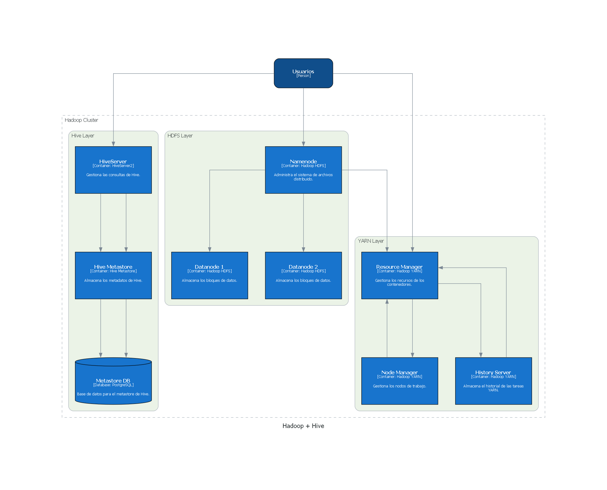

# INTRODUCCIÓN

Este repositorio contiene un archivo `docker-compose.yml` que despliega un clúster Hadoop completo utilizando contenedores Docker. A continuación, se explican los servicios incluidos, sus propósitos y configuraciones.

- [INTRODUCCIÓN](#introducción)
- [Cómo usar este archivo](#cómo-usar-este-archivo)
- [Arquitectura](#arquitectura)
  - [Vista Global](#vista-global)
  - [Red](#red)
- [Servicios](#servicios)
  - [1. **Namenode**](#1-namenode)
  - [2. **Datanode-1**](#2-datanode-1)
  - [3. **Datanode-2**](#3-datanode-2)
  - [4. **ResourceManager**](#4-resourcemanager)
  - [5. **NodeManager**](#5-nodemanager)
  - [6. **HistoryServer**](#6-historyserver)
  - [7. **HiveServer**](#7-hiveserver)
  - [8. **Metastore**](#8-metastore)
  - [9. **Metastore DB**](#9-metastore-db)
- [PRUEBAS](#pruebas)
  - [Ejecución de Mapreduce](#ejecución-de-mapreduce)
- [TO-DO](#to-do)
- [Créditos](#créditos)
- [Enlaces](#enlaces)
  - [Puertos de Hadoop:](#puertos-de-hadoop)
  - [Paso a Paso](#paso-a-paso)

# Cómo usar este archivo

1. Clona el repositorio y navega al directorio donde se encuentra el archivo `docker-compose.yml`.
2. Asegúrate de que los archivos de configuración mencionados (`.env`) estén correctamente configurados en el directorio `./conf`.
3. Inicia los contenedores:
   ```bash
   docker-compose up -d
   ```
4. Verifica el estado de los servicios accediendo a los puertos expuestos a través de tu navegador:

   - **Namenode**: [http://localhost:9870](http://localhost:9870)
   - **Datanode-1**: [http://localhost:9864](http://localhost:9864)
   - **Datanode-2**: [http://localhost:9865](http://localhost:9865)
   - **ResourceManager**: [http://localhost:8088](http://localhost:8088)
   - **NodeManager**: [http://localhost:8042](http://localhost:8042)
   - **HistoryServer**: [http://localhost:8188](http://localhost:8188)
   - **HiveServer**: [http://localhost:10000](http://localhost:10000) (y también en [http://localhost:10002](http://localhost:10002))

También puedes ejecutar: 

```bash
docker-compose ps
```

para ver algo como ésto:

```bash
NAME              IMAGE                                           COMMAND                  SERVICE           CREATED          STATUS                    PORTS
datanode-1        timveil/docker-hadoop-datanode:3.2.x            "/entrypoint.sh /run…"   datanode-1        13 minutes ago   Up 13 minutes (healthy)   0.0.0.0:9864->9864/tcp
datanode-2        timveil/docker-hadoop-datanode:3.2.x            "/entrypoint.sh /run…"   datanode-2        13 minutes ago   Up 13 minutes (healthy)   0.0.0.0:9865->9864/tcp
historyserver     timveil/docker-hadoop-historyserver:3.2.x       "/entrypoint.sh /run…"   historyserver     13 minutes ago   Up 13 minutes (healthy)   0.0.0.0:8188->8188/tcp
hiveserver        timveil/docker-hadoop-hive-hs2:3.1.x            "/entrypoint.sh /run…"   hiveserver        13 minutes ago   Up 13 minutes             0.0.0.0:10000->10000/tcp, 0.0.0.0:10002->10002/tcp
metastore         timveil/docker-hadoop-hive-metastore:3.1.x      "/entrypoint.sh /run…"   metastore         13 minutes ago   Up 13 minutes             10000/tcp, 10002/tcp
metastore-db      timveil/docker-hadoop-hive-metastore-db:3.1.x   "docker-entrypoint.s…"   metastore-db      13 minutes ago   Up 13 minutes             0.0.0.0:5432->5432/tcp
namenode          timveil/docker-hadoop-namenode:3.2.x            "/entrypoint.sh /run…"   namenode          13 minutes ago   Up 13 minutes (healthy)   0.0.0.0:9870->9870/tcp
nodemanager       timveil/docker-hadoop-nodemanager:3.2.x         "/entrypoint.sh /run…"   nodemanager       13 minutes ago   Up 13 minutes (healthy)   0.0.0.0:8042->8042/tcp
resourcemanager   timveil/docker-hadoop-resourcemanager:3.2.x     "/entrypoint.sh /run…"   resourcemanager   13 minutes ago   Up 13 minutes (healthy)   0.0.0.0:8088->8088/tcp
```

Es importante que los servicios `namenode`, `datanode`, y `resourcemanager` estén funcionando correctamente antes de ejecutar tareas en el clúster.

# Arquitectura

## Vista Global



## Red
- **Red:** `hadoop_network`
  - Tipo: `bridge`.
  - Todos los servicios comparten esta red para facilitar la comunicación interna.


# Servicios

## 1. **Namenode**
- **Imagen:** `timveil/docker-hadoop-namenode:3.2.x`
- **Descripción:**
  - El NameNode es el maestro del clúster Hadoop. Administra el sistema de archivos distribuido (HDFS) y mantiene el directorio jerárquico de archivos.
- **Puertos expuestos:**
  - `9870`: Interfaz web para monitoreo del HDFS.
- **Volúmenes:**
  - `./shared:/shared`: Carpeta compartida entre los servicios.
- **Variables de entorno:**
  - `CLUSTER_NAME`: Nombre del clúster.
  - Archivos de configuración: `core.env`, `yarn-remote.env`.
- **URL:**
  - [http://localhost:9870](http://localhost:9870)

---

## 2. **Datanode-1**
- **Imagen:** `timveil/docker-hadoop-datanode:3.2.x`
- **Descripción:**
  - El DataNode almacena los bloques de datos del sistema de archivos HDFS y realiza la lectura y escritura de datos.
- **Puertos expuestos:**
  - `9864`: Puerto para la comunicación con el NameNode.
- **Volúmenes:**
  - No tiene volúmenes expuestos.
- **Variables de entorno:**
  - `SERVICE_PRECONDITION`: Indica que el NameNode debe estar disponible.
  - Archivos de configuración: `core.env`, `yarn-remote.env`.
- **URL:**
  - [http://localhost:9864](http://localhost:9864)

---

## 3. **Datanode-2**
- **Imagen:** `timveil/docker-hadoop-datanode:3.2.x`
- **Descripción:**
  - Similar al DataNode-1, este nodo almacena bloques de datos y realiza operaciones de lectura y escritura en HDFS.
- **Puertos expuestos:**
  - `9865`: Puerto para la comunicación con el NameNode.
- **Volúmenes:**
  - No tiene volúmenes expuestos.
- **Variables de entorno:**
  - `SERVICE_PRECONDITION`: Indica que el NameNode debe estar disponible.
  - Archivos de configuración: `core.env`, `yarn-remote.env`.
- **URL:**
  - [http://localhost:9865](http://localhost:9865)

---

## 4. **ResourceManager**
- **Imagen:** `timveil/docker-hadoop-resourcemanager:3.2.x`
- **Descripción:**
  - El ResourceManager gestiona los recursos de cómputo en el clúster Hadoop y coordina la ejecución de aplicaciones en el clúster.
- **Puertos expuestos:**
  - `8088`: Interfaz web para monitoreo y gestión de trabajos en YARN.
- **Volúmenes:**
  - No tiene volúmenes expuestos.
- **Variables de entorno:**
  - `SERVICE_PRECONDITION`: Indica que el NameNode y los DataNodes deben estar disponibles.
  - Archivos de configuración: `core.env`, `yarn-resource-manager.env`.
- **URL:**
  - [http://localhost:8088](http://localhost:8088)

---

## 5. **NodeManager**
- **Imagen:** `timveil/docker-hadoop-nodemanager:3.2.x`
- **Descripción:**
  - El NodeManager se ejecuta en cada nodo de trabajo y gestiona los recursos locales y la ejecución de aplicaciones en ese nodo.
- **Puertos expuestos:**
  - `8042`: Interfaz web para monitoreo del estado de los contenedores en YARN.
- **Volúmenes:**
  - No tiene volúmenes expuestos.
- **Variables de entorno:**
  - `SERVICE_PRECONDITION`: Indica que el NameNode, DataNodes y ResourceManager deben estar disponibles.
  - Archivos de configuración: `core.env`, `yarn-node-manager.env`.
- **URL:**
  - [http://localhost:8042](http://localhost:8042)

---

## 6. **HistoryServer**
- **Imagen:** `timveil/docker-hadoop-historyserver:3.2.x`
- **Descripción:**
  - El HistoryServer permite la visualización de la información de trabajos anteriores en el clúster Hadoop.
- **Puertos expuestos:**
  - `8188`: Interfaz web para visualizar el historial de trabajos en YARN.
- **Volúmenes:**
  - No tiene volúmenes expuestos.
- **Variables de entorno:**
  - `SERVICE_PRECONDITION`: Indica que el NameNode, DataNodes y ResourceManager deben estar disponibles.
  - Archivos de configuración: `core.env`, `yarn-timeline.env`.
- **URL:**
  - [http://localhost:8188](http://localhost:8188)

---

## 7. **HiveServer**
- **Imagen:** `timveil/docker-hadoop-hive-hs2:3.1.x`
- **Descripción:**
  - El HiveServer2 permite la interacción con Apache Hive para ejecutar consultas SQL en Hadoop.
- **Puertos expuestos:**
  - `10000`: Puerto para la interfaz HiveServer2.
  - `10002`: Puerto para la interfaz HiveServer2 (puede ser utilizado por clientes de diferentes aplicaciones).
- **Volúmenes:**
  - `./shared:/shared`: Carpeta compartida entre los servicios.
- **Variables de entorno:**
  - `SERVICE_PRECONDITION`: Indica que el metastore debe estar disponible.
  - Archivos de configuración: `core.env`, `yarn-remote.env`, `hive.env`.
- **URL:**
  - [http://localhost:10000](http://localhost:10000) y [http://localhost:10002](http://localhost:10002)

---

## 8. **Metastore**
- **Imagen:** `timveil/docker-hadoop-hive-metastore:3.1.x`
- **Descripción:**
  - El Metastore de Hive almacena los metadatos de las tablas y bases de datos de Hive.
- **Puertos expuestos:**
  - No tiene puertos HTTP expuestos directamente.
- **Volúmenes:**
  - `./shared:/shared`: Carpeta compartida entre los servicios.
- **Variables de entorno:**
  - `SERVICE_PRECONDITION`: Indica que el NameNode, DataNodes y Metastore DB deben estar disponibles.
  - Archivos de configuración: `core.env`, `yarn-remote.env`, `hive.env`, `metastore.env`.
- **URL:**
  - No tiene un enlace web expuesto directamente.

---

## 9. **Metastore DB**
- **Imagen:** `timveil/docker-hadoop-hive-metastore-db:3.1.x`
- **Descripción:**
  - La base de datos de Metastore almacena los metadatos de Hive.
- **Puertos expuestos:**
  - `5432`: Puerto para la base de datos PostgreSQL.
- **Volúmenes:**
  - `./shared:/shared`: Carpeta compartida entre los servicios.
- **Variables de entorno:**
  - No tiene variables de entorno específicas de la interfaz web.
- **URL:**
  - No tiene un enlace web expuesto directamente.


# PRUEBAS

## Ejecución de Mapreduce

Conectados al resourcemanager:

```bash
# Vamos al directorio compartido
cd /shared
# Damos permisos de ejecución al archivo
chmod +x test-mapreduce.sh
# Ejecutamos el archivo
./test-mapreduce.sh
```

## Ejecución de Hive

Conectados al hiveserver:

```bash
# Vamos al directorio compartido
cd /shared
# Damos permisos de ejecución al archivo
chmod +x test-mapreduce.sh
# Ejecutamos el archivo
./test-mapreduce.sh
```

# TO-DO

El anterior stack tiene puntos de mejora pendientes:

- Actualizar versiones de Hadoop, Java, Hive.
- Añadir Spark
- Persistir datos

# Créditos
Este clúster utiliza imágenes Docker mantenidas por [Tim Veil](https://hub.docker.com/u/timveil).

# Enlaces

## Puertos de Hadoop:

- https://www.stefaanlippens.net/hadoop-3-default-ports.html

## Paso a Paso

- https://www.writecode.es/2019-02-25-cluster_hadoop_docker/
- https://www.writecode.es/2019-03-08-cluster-hadoop-hive-docker/
- https://www.writecode.es/2019-04-30-cluster-hadoop-spark-docker/